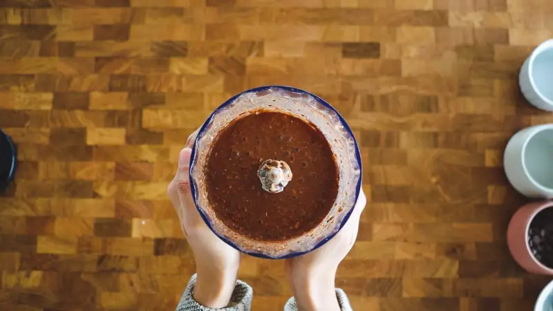
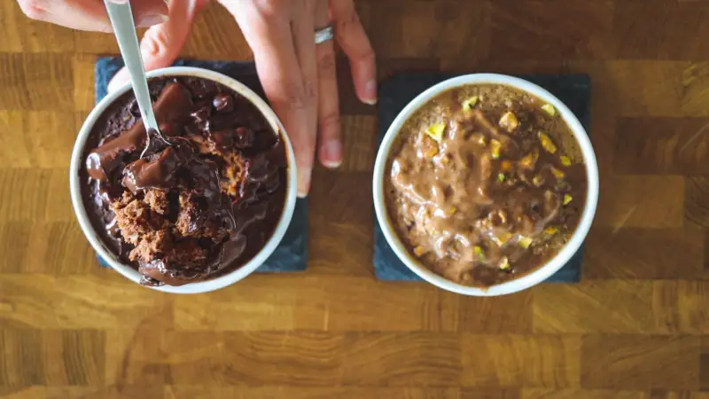

# How to make Baked Oats

There are many things I enjoy eating, so I found adaptations that do not
use animal products. This looks and tastes great and is easy to make.
Completing these steps will give you oats with a cake-like texture and a
picture-worthy presentation.

## Prerequisites

You will need the following:

- ½ cup of rolled oats

- 1/3 cup of non-dairy milk of your choice

- 1 tbs peanut butter

- ½ ripe banana

- ¼ tsp vanilla

- 1 tbs maple syrup

- 1.2 tsp baking powder

- 1 ramekin

- 1 tbs cooking oil

- Hand blender

- Pinch of salt

## Steps

1. Preheat the oven to 350 degrees Fahrenheit.

2. Add all the ingredients to a hand blender.

      
    *Figure E: Consistency of baked oats needed.*

3. Blend until smooth (the texture of figure E), which will take about
    one minute.

4. Line the ramekin with cooking oil

5. Pour the blending mixture into the ramekin.

6. Once the oven reaches the heat needed, add the filled ramekin to the
    oven.

7. Bake for about 20 minutes, or until the oats reach a cake-like
    consistency as shown in figure F.

      
    *Figure F: Texture of finished baked oats.*

8. Take out of the oven and cool for 10 minutes before eating.  
  **Take caution, the ramekin will be hot.**


