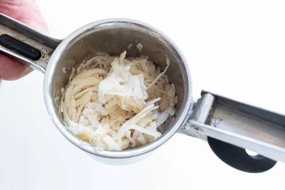

# How to make Crispy Hashbrowns

This is one of my favorite meals to make, for having so little
ingredients it has a lot of flavors! These hashbrowns are very crispy,
giving you a perfect crunch with each bite.

## Prerequisites

- 16oz Shaved Potatoes

- 1oz oil

- Wok

- Pinch of salt

- Bowl

- Black pepper

- Spatula

## Steps

*Figure G: Shaved hashbrowns*

1. Prepare potatoes in hashbrown strips, they should look like Figure
    G.

    a.  If frozen, thaw in a bowl of water.

    b.  If cutting, wash in a bowl of water.

2. Pat a handful together and dry until there is little to no moisture.

3. Repeat step two until you have multiple clumps of hashbrowns

4. Add oil to the wok and place it on the stove

5. Once the oil is hot, add hashbrowns to the wok.

6. Season the hashbrowns with salt and pepper.

    
    *Figure H: Fried hashbrown*

7. Once the hashbrown is golden brown like the image of figure H, flip
    the hashbrown.

8. Remove the hashbrown from the wok

9. Serve immediately.


