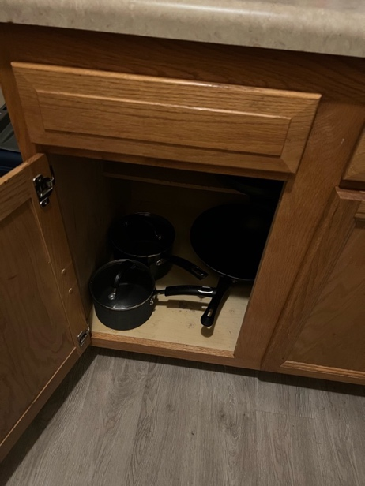

# Kitchen Organization

  
*Figure A: Pots and pans will be found below the counter next to the
fridge.*

  
*Figure B: The stove. It is electric and will heat up quickly.*

  
*Figure C: The Rack with all utensils and dry ingredients that you will
need.*


