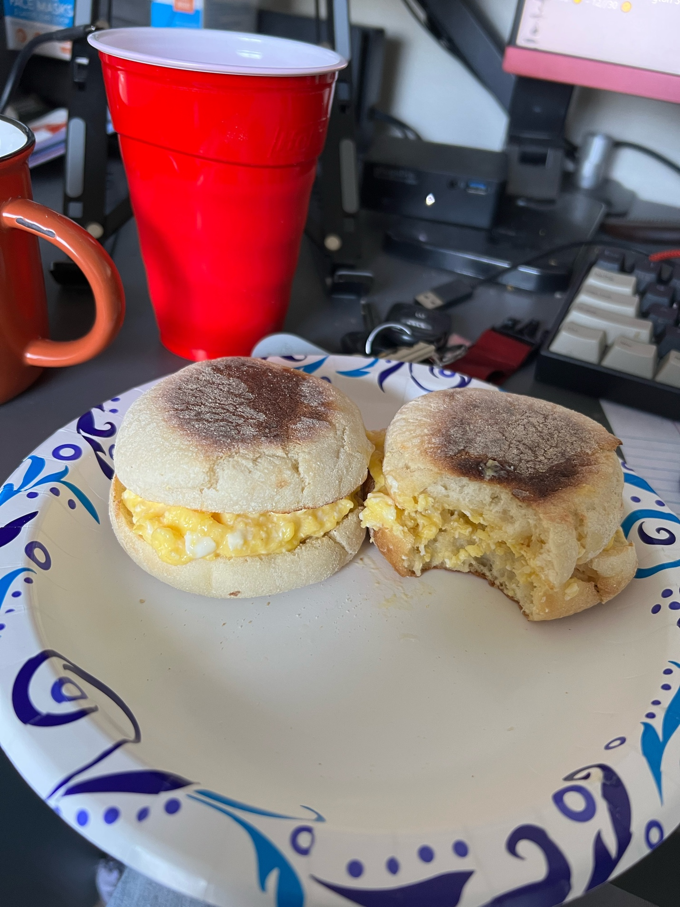

# How to make Gordon Ramsay Eggs

I do not have as many ingredients as you, but here is a recipe I believe
you would enjoy for yourself. It might seem complicated, but it is very
simple. These eggs are amazing when done right and have a cheesiness to
them without even adding cheese.

## Prerequisites

You will need the following:

- 2 Raw Eggs

- 1 Tbs Butter

- 1 tsp Crème fraiche

- 3oz Scallions, cut

- Small pot

- Mixing spoon

- Seasonings of your choice

## Steps

1. Place the pot on the stove and set it to medium heat.

2. Add all the butter to the pot.

3. Once the butter is slightly melted, crack both eggs in the pot.

4. Begin stirring with the spoon for 30 seconds on heat.

5. While still stirring, take it off the stove for 30 seconds.

    
    *Figure D: The consistency needed for the eggs in step 6 (English muffin not included).*

6. Repeat steps 4 and 5 again, until the eggs have a solid, yet creamy consistency as shown in figure D.

7. Remove the pot from the stove.

8. Add the crème fraiche and seasonings of your choice.

9. Stir and plate immediately

10. Add cut scallions on top of the eggs.


