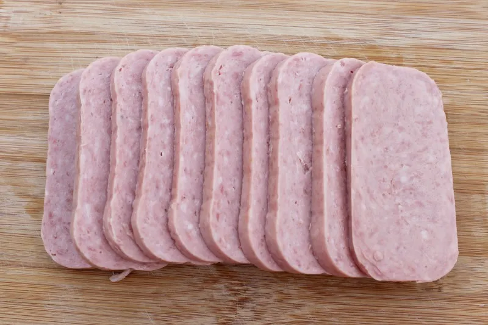

# How to make spam

This is my take on the meal that I've had so many times. Delicious and
packs a kick. This simple meal will transform the plain spam into a
flavorful dish with a thick sauce.

## Prerequisites

- Frying pan

- Small pot

- 4cups Water

- Spatula

- ½ Onion, Diced

- 1 Can of Spam

- 1tsp Red Pepper flakes

- 2tbs ketchup

- 1tbs cooking oil

## Steps

  
*Figure I: How the spam should be cut*

1. Prepare the Spam

    a.  Add the water to the small pot and bring it to a boil.

    b.  Add spam to the boiling water.

    c.  Once 5 minutes have passed, remove the spam from the water.

    d.  Cut Spam into slices as shown in Figure I.

2. Add oil to the frying pan

3. Once the oil is hot, add the onions to the pan

4. Once the onions are soft, add the sliced Spam to the pan.

5. Fry for 5 minutes.

6. Add the ketchup and pepper flakes to the pan

7. Cook for an additional two minutes, or until the ketchup is a sticky
    consistency.

8. Serve.


